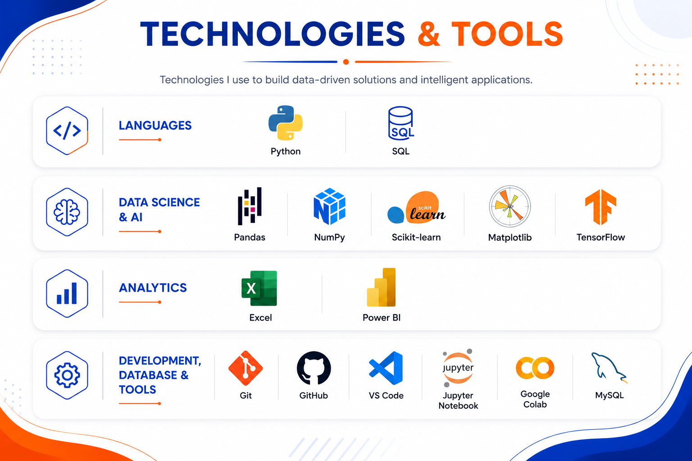

<h1>Muhammad Hassan</h1>

Driven by curiosity and continuous learning, I'm exploring <strong>Artificial Intelligence</strong>, <strong>Machine Learning</strong>, <strong>Data Science</strong>, <strong>Data Analytics</strong>, <strong>Software Development</strong>, and <strong>Project Management</strong> while building practical projects, strengthening my technical foundation, and turning ideas into impactful digital solutions.

  

---

<h2 align="center">Profile</h2>

| **Education** | Pursuing a Bachelor's Degree in Data Science |
|:--------------|:--------------------------------------------|
| **Interests** | Artificial Intelligence • Machine Learning • Data Science • Data Analytics |
| **Development** | Software Development |
| **Also Exploring** | Project Management |
| **Current Focus** | Building practical projects, expanding technical expertise, and solving real-world problems. |

---

<h2 align="center">Professional Experience</h2>

<table>
  <tr>
    <th>Organization</th>
    <th>Role</th>
  </tr>
  <tr>
    <td>Solutions Boat</td>
    <td>Software Trainer</td>
  </tr>
  <tr>
    <td>Elevvo Pathways</td>
    <td>Data Analytics Intern</td>
  </tr>
</table>

---

  

---

<h2 align="center">GitHub Achievements</h2>

---

<h2 align="center">Profile Statistics</h2>

---

<h2 align="center">Contribution Snake</h2>

<i>Snake animation will appear here once GitHub Actions are configured.</i>

<picture>
  <source
    media="(prefers-color-scheme: dark)"
    srcset="https://raw.githubusercontent.com/mhassanbuilds/mhassanbuilds/output/github-contribution-grid-snake-dark.svg">
  <source
    media="(prefers-color-scheme: light)"
    srcset="https://raw.githubusercontent.com/mhassanbuilds/mhassanbuilds/output/github-contribution-grid-snake.svg">
  
</picture>

