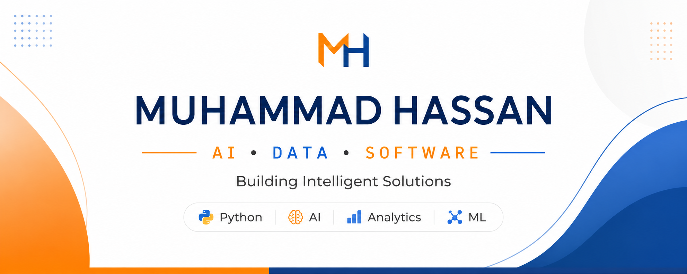

# Muhammad Hassan

Driven by curiosity and continuous learning, I'm exploring Artificial Intelligence, Machine Learning, Data Science, Data Analytics, Software Development, and Project Management while building practical projects, strengthening my technical foundation, and turning ideas into impactful digital solutions.

---

## Profile

| Category | Details |
|:---------|:--------|
| Education | Pursuing a Bachelor's Degree in Data Science |
| Interests | Artificial Intelligence • Machine Learning • Data Science • Data Analytics |
| Development | Software Development |
| Also Exploring | Project Management |
| Current Focus | Building practical projects, expanding technical expertise, and solving real-world problems through continuous learning |
